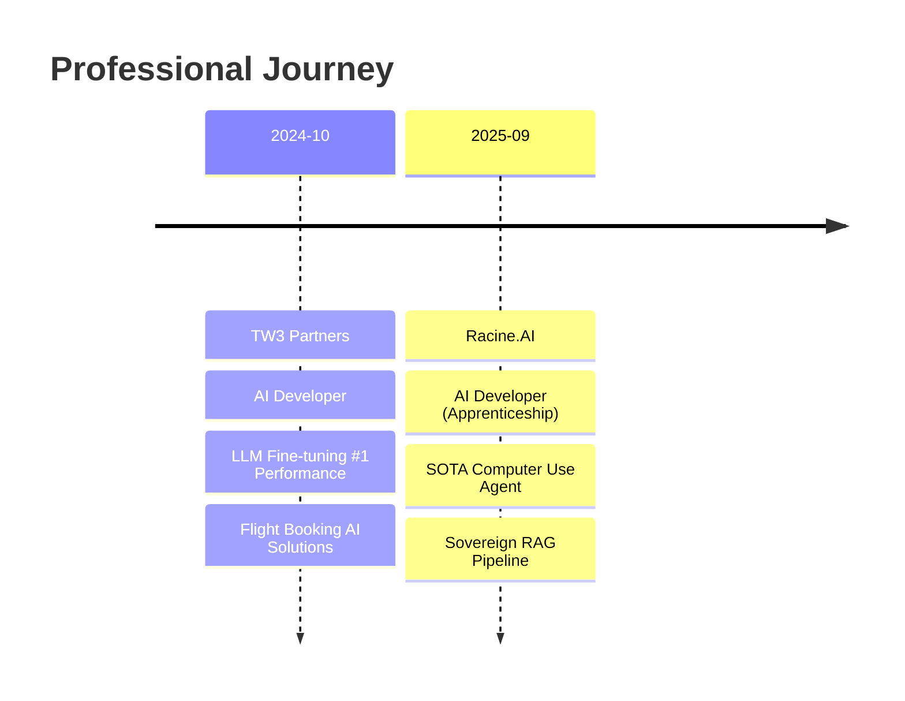

<div align="center">
  
[](https://git.io/typing-svg)

<br/>

[](mailto:david.sv04@outlook.fr)
[](https://linkedin.com/in/YOUR_LINKEDIN)
[](https://huggingface.co/YOUR_HF)

</div>

---

## 🧠 About Me

```python
class AIEngineer:
    def __init__(self):
        self.name = "David Soeiro-Vuong"
        self.location = "Paris, France 🇫🇷"
        self.education = "ECE Paris - Data & AI Engineering"
        self.current_role = "AI Developer @ Racine.AI"
        self.looking_for = "Summer Internship (May 2026)"
        
    def skills(self):
        return {
            "AI/ML": ["LLM Fine-tuning", "RAG Pipelines", "Computer Vision", "NLP"],
            "Models": ["Qwen", "YOLOv11", "RF-DETR", "Gemini"],
            "Stack": ["Python", "PyTorch", "HuggingFace", "LangChain"],
            "Infra": ["S3", "SharePoint", "OCR Pipelines", "Vector DBs"]
        }
    
    def achievements(self):
        return "🏆 +20% SOTA on WebClick Benchmark (70.8% accuracy)"
```

---

## 🚀 Featured Projects

<table>
<tr>
<td width="50%">

### 🤖 Computer Use Agent System
**SOTA Results on WebClick Benchmark**

Built around **CU-1** visual perception model based on **RF-DETR-M**
- 🎯 **70.8% accuracy** on WebClick
- 📈 **+20% improvement** over previous SOTA
- 🔧 Class-agnostic UI element detection
- ⚡ Reliable automation of complex tasks

</td>
<td width="50%">

### 🔗 Sovereign RAG Pipeline
**100% Open-Source for Energy Sector**

End-to-end document intelligence system
- 📄 SharePoint → S3 automation
- 🧠 Fine-tuned **Qwen3 Embedding 4B**
- 🔍 OCR + Chunking + Vector Storage
- 💬 Internal chatbot with open-source LLM

</td>
</tr>
<tr>
<td width="50%">

### 🎾 AI Tennis Match Analyzer
**Real-time Computer Vision Pipeline**

- 🎥 Real-time video analysis
- 🏃 Fine-tuned **YOLOv11** detection
- 📊 Structured analytical output
- 🎬 Annotated video generation

</td>
<td width="50%">

### 🗑️ Smart Urban Waste Detection
**TACO Dataset - 6 Categories**

- 🎯 Custom **YOLOv11** model
- 🏷️ High-precision classification
- 🤖 **Gemini AI** contextual analysis
- 🌍 Urban environment optimization

</td>
</tr>
</table>

---

## 💼 Experience



---

## 🛠️ Tech Stack

<div align="center">

### Languages & Frameworks


### AI/ML


### Tools & Infrastructure


</div>

---

## 📊 GitHub Stats

<div align="center">
  


<br/>

[](https://git.io/streak-stats)

</div>

---

## 🌐 Languages

<div align="center">

| 🇫🇷 French | 🇬🇧 English | 🇨🇳 Chinese |
|:---:|:---:|:---:|
| Native | Fluent (TOEIC 880) | Intermediate |

</div>

---

<div align="center">
  
### 💡 Open to Summer Internship Opportunities (May 2026)

*Let's build the future of AI together!*

<br/>


</div>


